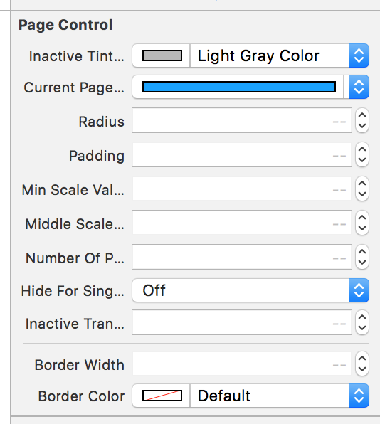

# ISPageControl

[](https://github.com/Carthage/Carthage)
[](http://cocoapods.org/pods/Hero)


[](https://github.com/lkzhao/Hero/blob/master/LICENSE?raw=true)

**ISPageControl** has a page control similar to that used in the Instagram


## Contents

- [Requirements](#requirements)
- [Installation](#installation)
- [Usage](#usage)
- [Communication](#communication)
- [Credits](#credits)
- [License](#license)

## Requirements

- iOS 8.0+
- Xcode 9.0+
- Swift 4.0+

## Installation

### CocoaPods

[CocoaPods](http://cocoapods.org) is a dependency manager for Cocoa projects. You can install it with the following command:

```bash
$ gem install cocoapods
```

> CocoaPods 1.1+ is required to build ISPageControl 4.0+.

To integrate ISPageControl into your Xcode project using CocoaPods, specify it in your `Podfile`:

```ruby
source 'https://github.com/CocoaPods/Specs.git'
platform :ios, '8.0'
use_frameworks!

target '<Your Target Name>' do
pod 'ISPageControl', '~> 0.1.0'
end
```

Then, run the following command:

```bash
$ pod install
```

### Carthage

[Carthage](https://github.com/Carthage/Carthage) is a decentralized dependency manager that builds your dependencies and provides you with binary frameworks.

You can install Carthage with [Homebrew](http://brew.sh/) using the following command:

```bash
$ brew update
$ brew install carthage
```

To integrate ISPageControl into your Xcode project using Carthage, specify it in your `Cartfile`:

```ogdl
github "Interactive-Studio/ISPageControl" ~> 0.1.0
```

Run `carthage update` to build the framework and drag the built `ISPageControl.framework` into your Xcode project.

### Manually

If you prefer not to use either of the aforementioned dependency managers, you can integrate ISPageControl into your project manually.

---

## Usage

The usage of **ISPageControl** is very simple

### Storyboard, Xib

Just drop UIView and set its class to be one of ISPageControl.



### Code

```swift
let frame = CGRect(x: 0, y: 500, width: UIScreen.main.bounds.width, height: 100)
pageControl = ISPageControl(frame: frame, numberOfPages: 4)
pageControl.radius = 10
pageControl.padding = 10
pageControl.inactiveTintColor = UIColor.purple
pageControl.borderWidth = 3
pageControl.borderColor = UIColor.red
view.addSubview(pageControl)
```

### Custom

```swift
@IBInspectable open var inactiveTintColor: UIColor

@IBInspectable open var currentPageTintColor: UIColor

@IBInspectable open var radius: CGFloat

@IBInspectable open var padding: CGFloat

@IBInspectable open var minScaleValue: CGFloat

@IBInspectable open var middleScaleValue: CGFloat

@IBInspectable open var numberOfPages: Int

@IBInspectable open var hideForSinglePage: Bool

@IBInspectable open var inactiveTransparency: CGFloat

@IBInspectable open var borderWidth: CGFloat

@IBInspectable open var borderColor: UIColor
```

If you want to know more detailed usage, please refer to Example.

## Communication

- If you **found a bug**, open an issue.
- If you **have a feature request**, open an issue.
- If you **want to contribute**, submit a pull request.

## Credits

- GwangBeom Park ([@gwangbeom](https://github.com/ParkGwangBeom))

## License

ISPageControl is released under the MIT license. See LICENSE for details.

